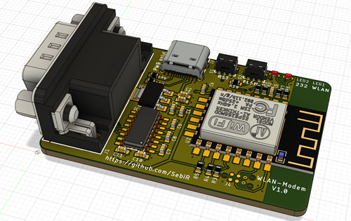

# RS232 WLAN Modem
An ESP8266 based device to emulate an old serial modem to get old hardware connected to the internet

## Features
* USB-C power (and power only)
* Can be used with male and female DSUB connectors
* Small form factor

# Firmware and acknowledgement
The whole device is based on the RS232 Serial WIFI Modem from The Old Net.
The firmware can be found here: https://github.com/ssshake/vintage-computer-wifi-modem

I just wanted to create a more compact version of the hardware.