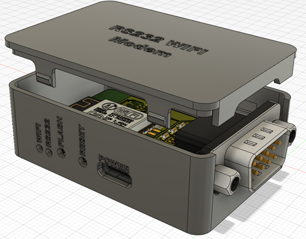

# RS232 WLAN Modem
An ESP8266 based device to emulate an old serial modem to get old hardware connected to the internet

## Features
* USB-C power
* Can be used with male and female DSUB connectors
* Small form factor

## Uses
The board was intended to be used as a RS232 modem replacement for an old PC. But with the right firmware it can of course be used for other stuff:
* Wireless RS232 bridge
* IoT/Tasmota/MQT bridge for RS232 defices
* ...

# 3D printed case
There's also a case for 3D printing available!

# Firmware and acknowledgement
The whole device is based on the RS232 Serial WIFI Modem from The Old Net.
The firmware can be found here: https://github.com/ssshake/vintage-computer-wifi-modem

I just wanted to create a more compact version of the hardware.

# Notes
The PCB has plated slots for the USB-C connector. The outline layer in the gerber files has a note for this. You might want to have an eye on the production files if you order the PCBs.